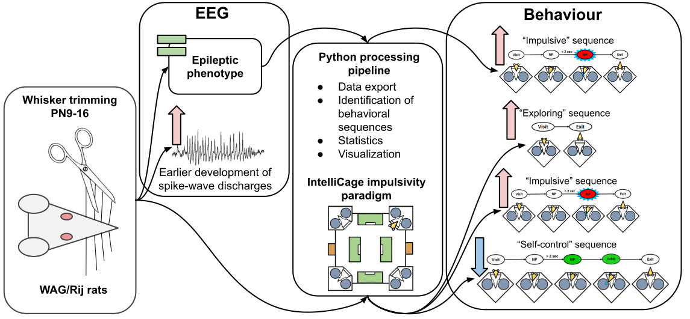

# IC-Auto
*Automated analysis of behavioral sequences in IntelliCage*

* IntelliCage is a modern system for conducting automated and long-term behavioral test on behaving rodents.

* A processing pipeline of Python packages was utilized to analyze behavioral data obtained in Intellicage.

* This allows for identification of novel behavioral sequences that were not apparent in manual analysis.

## Dependencies
The following packages are required for using the analysis scripts

* PyMICE
* Pingouin
* NumPy
* Pandas
* Matplotlib
 
## Usage
* IntelliCage archives for running the code are available upon reasonable request.

## References
* Esmaeili, A., Antonova, A., Sitnikova, E., & Smirnov, K. (2021). Whisker trimming during infanthood modifies the development of spike-wave discharges and behavioral sequences in IntelliCage impulsivity paradigm in adult WAG/Rij rats. *Behavioural Brain Research*
