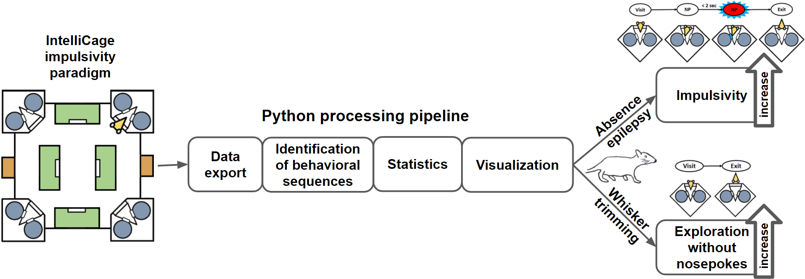

# IntelliCage automated analysis

* IntelliCage is a novel system for conducting automated and long-term behavioral test on behaving rodents.

* A processing pipeline of Python packages was utilized to analyze behavioral data obtained in Intellicage.

* This allows for identification of novel behavioral sequences that were not apparent in manual analysis.

